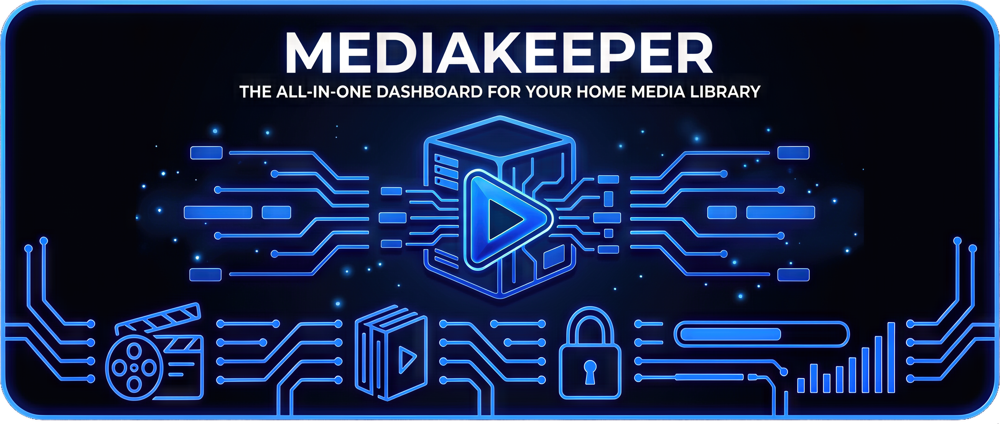

<p align="center">
  
</p>

<p align="center">
  <b>English</b> · <a href="README-fr.md">Français</a>
</p>

<p align="center">
  <i>Open-source self-hosted media library companion: dashboard, request portal, achievements, duplicates, missing-content tracking, statistics, subtitles and more.</i>
</p>

<p align="center">
  <a href="LICENSE"></a>
  <a href="https://github.com/KeeperD93/mediakeeper/actions/workflows/backend.yml"></a>
  <a href="https://github.com/KeeperD93/mediakeeper/actions/workflows/frontend.yml"></a>
  <a href="https://github.com/KeeperD93/mediakeeper/actions/workflows/security.yml"></a>
  <a href="https://discord.gg/A2hyNUUn6a"></a>
  <a href="https://ko-fi.com/keeperd93"></a>
  
</p>

---

> [!WARNING]
> **Under active development — not yet stable.**
>
> MediaKeeper is on its `v1.0.0-rc.x` line, ahead of the first stable `v1.0.0` release.
> Expect schema changes, breaking refactors, missing pieces and rough edges.
> Do not point it at production data you cannot afford to lose, and pin an
> immutable image tag (e.g. `ghcr.io/keeperd93/mediakeeper:v1.0.0-rc.3`) rather
> than `:latest` if you need reproducible behaviour.

---

## What is MediaKeeper?

MediaKeeper is a **single-container, self-hosted companion** for an Emby instance. It complements Emby with two surfaces in one app:

- A polished **admin back-office** for managing your library, spotting duplicates, watching activity, handling subtitles and more.
- A friendly **Portal viewer** designed for the people you share Emby with — catalogue browsing, requests, achievements, lists, daily digests, news, tickets and shared movie nights.

Everything runs from a **single Docker container** with an embedded PostgreSQL 16.

---

## Key features

MediaKeeper extends Emby with a back-office to run the instance and a Portal that brings your viewers a real product experience. Here is what stands out.

### Highlights

- **Immersive shared movie nights** — schedule events with a virtual cinema room.
- **Built-in request system** — viewers ask for films, shows or seasons; quotas, blacklist, auto-cleanup and admin moderation are wired in.
- **Achievements & XP** — 160+ trophies across families (community, watching, marathons, secrets, milestones, lists), levels up to 50, monthly leaderboard.
- **Public viewer profiles** — every viewer can customise a username, avatar, equip cosmetic titles, and other viewers can browse the public version of the profile.
- **User management** — manage your users, adjust their Emby access window, fill in profile information, track their statistics…
- **Daily digest** — a once-per-day "what's new today" overlay surfaces the monthly Top 3, the viewer's ranking, the latest additions and admin-curated news…

### Admin back-office

Built for the operator who keeps the Emby instance alive.

**Library health**

- **Dashboard** — live stats, services health, activity feed, customizable widget layout (drag-and-drop, mobile reorder via title list)
- **Statistics** — users, libraries, plays, charts with mobile-readable tables
- **Health check** — automatic library scan, severity grouping, issue posters, runnable on demand
- **Duplicates** — detection rules, history, ignored list, restore, fast cached access
- **Watchlist** — series tracking (missing seasons), audio language tags on episodes, monitoring rules, configurable scan

**File management**

- **Media Manager** (desktop) — browse, move, rename with the help of TMDB (API), tag, dedupe directly on disk, lasso selection…
- **Subtitles** — OpenSubtitles batch download, removal of language tracks and subtitle streams already on disk…

**User & request operations**

- **Users** — 7-tab drawer (identity, access, security, activity, trophies, notes, audit), granular roles & permissions (chat, requests, problems, lists, offline XP), access window with extension shortcuts, reversible soft-delete, audit log, admin notes, tags, per-user GDPR export
- **Requests premium** — search, filters, table/card view, bulk actions, auto-cleanup configurable, all-time totals per counter
- **News admin** — create, edit, delete and schedule entries (start/end dates)
- **Maintenance mode** — toggle a customizable maintenance message for the Portal
- **GDPR admin** — opt-in toggle, privacy text editable inline, lifecycle deletion in two steps

**Background work**

- **Scheduler** — recurring tasks with cache stats, manual triggers, hit/miss insights
- **Backups** — manual ZIPs + scheduled jobs + drill-tested restore procedure, SQL dump + Fernet encryption key embedded by default
- **Onboarding wizard** — guided first-boot configuration
- **Image / DNS cache** — performance toggles for the portal image proxy

### Portal viewer

Built for the people you share Emby with — gamified, social and friendly.

**Browse & discover**

- **Catalog Discover** — Trending, Popular, Top-rated, Oscars, Family, Upcoming, by Provider, personalised recommendations
- **Hero strip** — auto-rotating image slideshow (10 s crossfade)
- **Search** — instant TMDB suggestions with 5-min cache, recent history…
- **Detail pages** — premium sidebar (Lucide icons, status dot, language & country localised, original language read from TMDB)
- **Mobile-first** — 3-column poster grids on mobile, tap-to-open, dense layouts, dedicated mobile views where needed

**Engagement**

- **Requests** — submit movies, shows or seasons; quota tracking, status feedback, blacklist handling, clear error messages
- **Movie nights** — schedule shared cinema events, virtual room with marathon mode and per-event capacity (5/10/15/20), realtime presence, mobile-dedicated view, past events automatically locked after 6 h
- **Lists** — public, private or collaborative lists with anonymised pseudos, tied to the Curator and Librarian achievement families
- **Daily digest** — a once-per-day overlay summarising the day, with the monthly Top 3 and the viewer's ranking appended off-podium
- **News & announcements** — admin-scheduled posts surface in the bell

**Identity & community**

- **Custom username** — mandatory pick on first sign-in, live availability check, editable every 6 months, reserved usernames protected
- **Custom avatar** — inherit your Emby avatar or upload your own directly on MediaKeeper (up to 5 MB) + cosmetic titles preview before saving
- **Premium Settings** in five tabs — identity, appearance, preferences, visibility, account
- **Public profile pages** — card, bio, genres, trophies; reachable from the leaderboard
- **Login streak** indicator on the dedicated portal sign-in page

**Achievements & social**

- **160+ achievements** across families: community, watching, marathons, secrets, milestones, lists (Curator + Librarian, 5 tiers each)
- **XP system & levels** — progression up to 50, premium grade ladder
- **Monthly leaderboard** — premium showcase: monthly champion hero, live stats bar, top 100, enriched podium
- **Realtime chat** — moderation, unread counter persistent across sessions, report button locked after send, flagged messages visible to admins and moderators
- **Tickets** — pinpoint the exact movie, series, season or episode when reporting; filters by status / source / type; auto-close after 7 days of inactivity
- **Help center** — 15+ articles editable by admins with a rich-text editor, auto-save, drafts, 30-day restore trash

### Cross-cutting

- **Bilingual UI** (French + English) with strict locale parity; TMDB cascade `user → English → original → language-agnostic`
- **Single Docker container** with embedded PostgreSQL 16; production worker split available via `MK_SEPARATE_BACKGROUND_WORKER`; multi-arch ready (`amd64` + `arm64`)
- **Defensive security** — JWT scope separation admin / portal, CSRF double-submit, rate-limited login, Fernet-encrypted secrets at rest, log redaction, security CI workflow (`pip-audit`, `npm audit`, `bandit`, `ruff S`, `semgrep`)
- **Full accessibility** — focus traps on 20+ modals, ARIA labels, keyboard navigation, `prefers-reduced-motion`, toasts via `aria-live`, skip-to-main link
- **Notifications** — in-app bell with admin-pushed targeted messages + Discord webhooks
- **GDPR opt-in** — per-user export (JSON), privacy text editable by admin, lifecycle deletion in two steps

For the full feature catalogue and version history, see the [Wiki](https://github.com/KeeperD93/mediakeeper/wiki) and the changelogs ([admin EN](backend/CHANGELOG_EN.md) · [portal EN](backend/CHANGELOG_PORTAL_EN.md)).

---

## Preview

### Admin dashboard

<!-- screenshot placeholder: admin dashboard (widgets, ribbon, activity feed) — paste a 1200-1600px wide image here -->

### Portal viewer

<!-- screenshot placeholder: portal home (hero strip, lists, posters) — paste a 1200-1600px wide image here -->

---

## Getting started

### Quickstart — pull the published image

The fastest way is to pull the pre-built image from GitHub Container Registry. No clone, no build:

```sh
mkdir mediakeeper && cd mediakeeper
curl -O https://raw.githubusercontent.com/KeeperD93/mediakeeper/main/docker-compose.prod.yml
docker compose -f docker-compose.prod.yml up -d
```

The image is multi-arch (`linux/amd64` + `linux/arm64`) so it runs natively on Synology DSM, Raspberry Pi, traditional x86 servers, etc.

**Available image tags:**

| Tag       | Pointer                                       | Recommended for                      |
| --------- | --------------------------------------------- | ------------------------------------ |
| `:latest` | most recent stable release                    | everyday self-hosters                |
| `:beta`   | most recent pre-release / release-candidate   | early adopters, testing              |
| `:vX.Y.Z` | exact release (immutable)                     | reproducible deployments, CI pinning |
| `:X.Y`    | floats on the X.Y patch series (e.g. `:0.10`) | following a single minor line        |

### Alternative — clone and build from source

For contributors or anyone wanting bleeding-edge `main`:

```sh
git clone https://github.com/KeeperD93/mediakeeper.git
cd mediakeeper
docker compose up -d
```

This uses `docker-compose.yml` (with `build: .`) and compiles a fresh image from the local source.

### First boot

**No `.env` required for a first boot**. MediaKeeper auto-generates everything sensitive on first startup and persists it under `/data/`:

- the PostgreSQL password,
- the JWT secret (≥ 32 bytes),
- the Fernet encryption key for secrets stored in the database,
- an initial **admin** account with a random password printed once in the container logs.

Read the initial admin password from the logs as soon as the container is up:

```sh
docker compose logs mediakeeper | grep -A 6 "ADMIN ACCOUNT CREATED"
```

(Use `docker compose -f docker-compose.prod.yml logs mediakeeper` instead if you started from the GHCR quickstart.)

> [!IMPORTANT]
> Capture this password immediately. It is **not** persisted to `/data/`. If you miss it (terminal closed, logs rotated), recover with the CLI helper — see [`docs/operations/admin-recovery.md`](docs/operations/admin-recovery.md).

Then open `http://<host>:8888`, sign in as `admin` with that password — a password change is forced on first connection.

**Need to customise?** Copy `.env.example` to `.env` and adjust the variables you need (e.g. `TMDB_API_KEY`, `FRONTEND_ORIGIN`, `MEDIAKEEPER_PATH_ROOTS`) before running `docker compose up -d`. Auto-generated values are respected on subsequent boots.

The application runs `alembic upgrade head` at boot, so database migrations are applied automatically.

Updating an existing install? See [`docs/operations/updating.md`](docs/operations/updating.md).

For Synology DSM, reverse-proxy setups, TLS deployment and advanced configuration, see the [Wiki](https://github.com/KeeperD93/mediakeeper/wiki) and the operations runbooks in [`docs/operations/`](docs/operations/).

---

## 📖 Documentation

| Surface                                                                    | Where                                                                                                                                                                                                                    |
| -------------------------------------------------------------------------- | ------------------------------------------------------------------------------------------------------------------------------------------------------------------------------------------------------------------------ |
| User wiki                                                                  | https://github.com/KeeperD93/mediakeeper/wiki                                                                                                                                                                            |
| Operations runbooks (admin / sysadmin)                                     | [`docs/operations/`](docs/operations/)                                                                                                                                                                                   |
| Deployment guides (Caddy, Traefik, Nginx Proxy Manager, LAN, Synology DSM) | [`docs/deployment/`](docs/deployment/)                                                                                                                                                                                   |
| Contributing                                                               | [`CONTRIBUTING.md`](CONTRIBUTING.md)                                                                                                                                                                                     |
| Security policy                                                            | [`SECURITY.md`](SECURITY.md)                                                                                                                                                                                             |
| Code of conduct                                                            | [`CODE_OF_CONDUCT.md`](CODE_OF_CONDUCT.md)                                                                                                                                                                               |
| Third-party licences                                                       | [`THIRD_PARTY_LICENSES.md`](THIRD_PARTY_LICENSES.md)                                                                                                                                                                     |
| Changelog                                                                  | Admin: [`CHANGELOG_FR`](backend/CHANGELOG_FR.md) · [`CHANGELOG_EN`](backend/CHANGELOG_EN.md) · Portal: [`CHANGELOG_PORTAL_FR`](backend/CHANGELOG_PORTAL_FR.md) · [`CHANGELOG_PORTAL_EN`](backend/CHANGELOG_PORTAL_EN.md) |

---

## Community & support

- **Discord** — [discord.gg/A2hyNUUn6a](https://discord.gg/A2hyNUUn6a)
- **GitHub Discussions** — https://github.com/KeeperD93/mediakeeper/discussions
- **Bug reports & feature requests** — https://github.com/KeeperD93/mediakeeper/issues
- **Security disclosures** — see [`SECURITY.md`](SECURITY.md); please do **not** open a public issue

---

## Buy me a coffee

MediaKeeper is free and open-source. If you find it useful, a coffee goes a long way:

- **Ko-fi** — [ko-fi.com/keeperd93](https://ko-fi.com/keeperd93) — one-time tips or recurring memberships, PayPal and cards accepted
- **Star the repo** — every star helps visibility on GitHub

---

## Contributing

Pull requests are welcome. Before you start, please read [`CONTRIBUTING.md`](CONTRIBUTING.md) and the [`CODE_OF_CONDUCT.md`](CODE_OF_CONDUCT.md).

In short:

1. Fork the repo and create a feature branch (`feat/...`, `fix/...`, `refactor/...`).
2. Follow the coding conventions in `CONTRIBUTING.md` (i18n, mobile-first, design tokens, file size).
3. Add tests for any new endpoint or composable.
4. Commit with [Conventional Commits](https://www.conventionalcommits.org/) format.
5. Open the PR; CI must pass before review.

---

## AI-assisted development

MediaKeeper is developed with AI assistance. Every change is reviewed, tested and committed by the maintainer, who remains responsible for the code that ships.

---

## Tech stack

| Layer        | Tech                                                                                                                      |
| ------------ | ------------------------------------------------------------------------------------------------------------------------- |
| **Frontend** | Vue 3 (`<script setup>`), Vue Router 5, vue-i18n 11, Vite 6, PrimeVue 4, Chart.js 4, lucide-vue-next, TipTap              |
| **Backend**  | FastAPI (Python 3.12), SQLAlchemy 2 (async), Alembic, PyJWT, bcrypt, httpx, slowapi, cryptography (Fernet), bleach        |
| **Database** | PostgreSQL 16 (production, embedded in the Docker image), SQLite (tests)                                                  |
| **Quality**  | ESLint, Prettier, Stylelint, Vitest, pytest + pytest-cov, Husky + commitlint, ruff, bandit, semgrep, pip-audit, npm audit |

---

## Attribution

This product uses the **TMDB API** but is not endorsed or certified by TMDB. See https://www.themoviedb.org for the data source.

MediaKeeper integrates with **Emby**, **OpenSubtitles**, **Discord** webhooks and (optionally) **Imgur**. Each provider's terms apply when those features are enabled. Full breakdown in [`THIRD_PARTY_LICENSES.md`](THIRD_PARTY_LICENSES.md).

---

## License

MediaKeeper is published under the **GNU General Public License v3.0 or later** — see [`LICENSE`](LICENSE).
